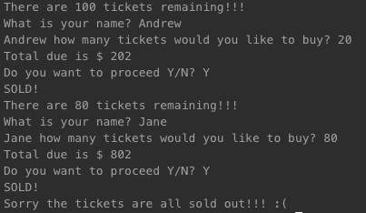
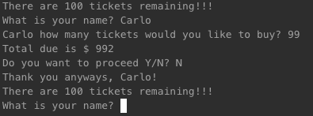

# TicketStore-App

User bought 20 tickets and paid $2 for service fee which brings the total down to $202. Prompt the user if they want to proceed if Yes then display text "SOLD!" and display remaining tickets. 

This program will keep looping till no more tickets left to sell

This shows when a user doesn't want to proceed

